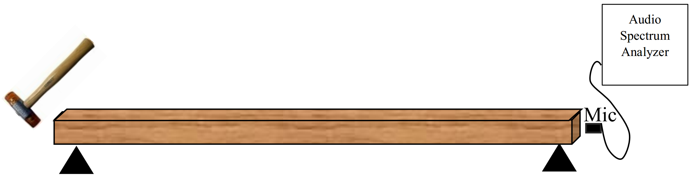

# Open Source Non-Destructive Wood MoE Evaluation
## Purpose of the software
This open source software developed to measure the MoE of wood with an acoustical method.
## The acoustical method
The acoustic method used in this program is the longitudinal stress wave technique as shown in figure below [1,2].
  

  
An impactor (e.g. hammer) induced a longitudinal stress wave. A longitudinal stress wave would propagate through the wood bar and a microphone record the signal. The audio spectrum analyzer transforms the time-domain signal to frequency-domain signal. The software acts as the spectrum analyzer.

## The instrumentation design
The software is part of the open source instrument called MyWood. The diagram block of the instrument is shown in figure below.
  

  

# Software structure
## Required Library
1. Tkinter as Graphical User Interface
2. Scipy as the numerical calculation engine
3. Matplotlib as plot library engine
4. PyAudio as the audio signal sampling engine
5. KayuEngine

## Core Engine
All the core engine of the program written in Python in module kayu_engine. The Python version is 3.5.

## User Interface
User interface of this project are developed in Python Tkinter written in module kayu_main.

# Miscellaneous
## dsp-hub folder
This folder contains my experiment in developing the dsp for the project.

## experiment-hub
This folder contains my experiment in developing other part of the project.

# Fork It
If you are a NDT engineer, feel free to fork this program to measure the NDT of the wood.

## References
[1] Ayutyastuti. (2015). Studi Kelayakan Metode Nondestructive Test Berbasis Akustik untuk Memprediksi Nilai Modulus Elastisitas Kayu. Universitas Gadjah Mada.
[2] Feliana, F. (2014). Studi Empiris Nilai Modulus Elastisitas Kayu Menggunakan Metode “Stress Wave Velocity.” Universitas Gadjah Mada.
