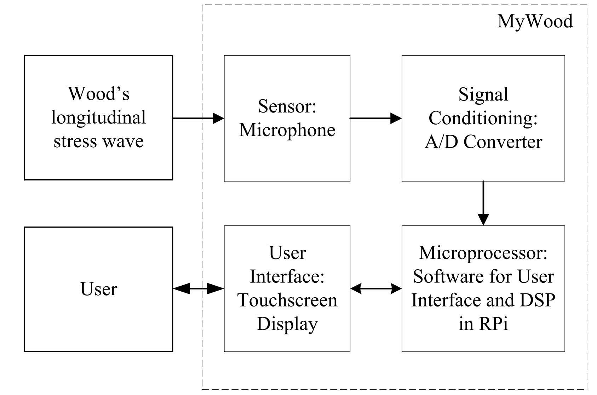
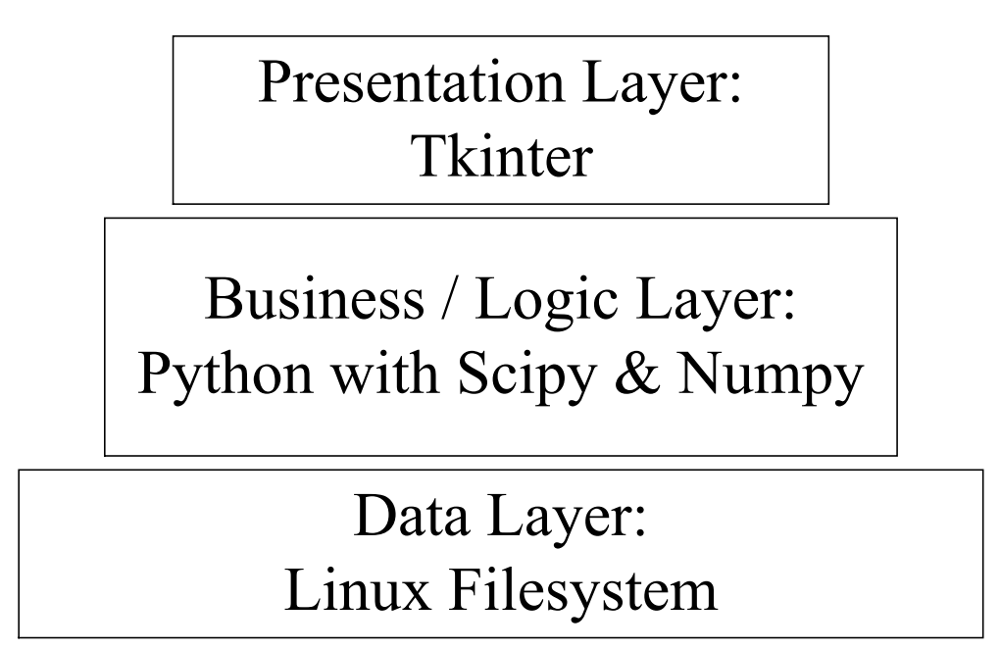

# Open Source Non-Destructive Wood MoE Evaluation
## Purpose of the software
This open source software developed to measure the MoE of wood with an acoustical method.
## The acoustical method
The acoustic method used in this program is the longitudinal stress wave technique as shown in figure below [1,2].
  

  
An impactor (e.g. hammer) induced a longitudinal stress wave. A longitudinal stress wave would propagate through the wood bar and a microphone record the signal. The audio spectrum analyzer transforms the time-domain signal to frequency-domain signal. The software acts as the spectrum analyzer.

## The instrumentation design
The software is part of the open source instrument called MyWood. The diagram block of the instrument is shown in figure below.
  

  
The microphone receives the wood's longitudinal stress wave signals and connected to the USB soundcard which acts as the signal sampling peripherals. The "brain" of the instrument is the Raspberry Pi Model 2 B. The user interface peripherals is the touchscreen display. The user interacts with the instrument with the touchscreen display.

## Software structure
This software developed with n-tier application architecture as shown in figure below.
  

  
The data layer is the linux filesystem which is the place to store the recorded audio wav file. The logic layer of the software is Python with Scipy and Numpy library. The presentation layer is the Tkinter.

## Required Library
1. Tkinter as Graphical User Interface
2. Scipy as the numerical calculation engine
3. Matplotlib as plot library engine
4. PyAudio as the audio signal sampling engine
5. kayu_engine

## References
[1] Ayutyastuti. (2015). Studi Kelayakan Metode Nondestructive Test Berbasis Akustik untuk Memprediksi Nilai Modulus Elastisitas Kayu. Universitas Gadjah Mada. 
[2] Feliana, F. (2014). Studi Empiris Nilai Modulus Elastisitas Kayu Menggunakan Metode “Stress Wave Velocity.” Universitas Gadjah Mada. 
